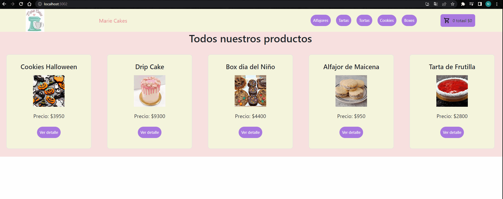

# Marie Cakes

> Mi proyecto de un e-commerce

## Este proyecto fue realizado utilizando la libreria de JavaScript, React

>Para ciertos estilos se utilizo boostrap y sweetalert2 para notificaciones

##Instalacion para uso dle proyecto


>git clone [](https://github.com/Nicolas-Pandolfo/MarieCakes-reactJS.git)

```bash
npm install

npm start
```

##Ejemplo de como desplazarse dentro de la pagina

>